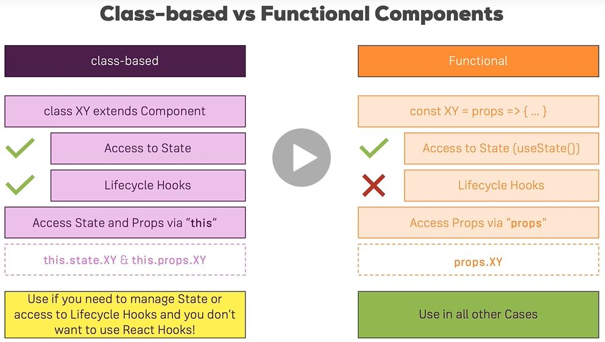

React Basics
==================
Udemy: React - The Complete Guide (incl Hooks, React Router, Redux)

- create-react-app: https://github.com/facebookincubator/create-react-app
- Introducing JSX: https://reactjs.org/docs/introducing-jsx.html
- Rendering Elements: https://reactjs.org/docs/rendering-elements.html
- Components & Props: https://reactjs.org/docs/components-and-props.html
- Listenable Events: https://reactjs.org/docs/events.html


## Introduction
// codepen.io
- Babel (js preprocessor for ES7)
- react.min.js
- react-dom.min.js

```shell script
// index.html
<div id="app"></div>

// index.js
function Person(props) {
  return (
    <div className="person">
      <h1>{props.name}</h1>
      <p>Your Age: {props.age}</p>
    </div>
  );
}

var app = (
  <div>
    <Person name="Max" age="28" />
    <Person name="Manu" age="29" />
  </div>
);

ReactDOM.render(app, document.querySelector('#app'));
```

Vs code plugin:
1.	ES7 React/Redux/GraphQL/React-Native snippets
2.	Bracket Pair Colorizer
3.	Auto Rename Tag
4.	"emmet.includeLanguages": {
    "javascript": "javascriptreact"
}

## create-react-app
ES6, npm, webpack, Babel + presets, dev server

Java/workspace/react/firstapp
```shell script
npm install -g create-react-app
create-react-app firstapp
```

## class-based components
also referred to as "containers", "smart" or "stateful" components
```shell script
import React, { Component } from 'react';
import './App.css';

class App extends Component {
  render() {
    state = {
      persons: [
        {name: 'Ma', age: 28},
        {name: 'Manu', age: 29}
      ]; 
    }; 

    // JFX only allow one root element, same as Vue.js.
    return (
      <div className="App">
	    <label for="myId">Display test page</label>
        <input type="text" value="" id="myId"/>
        <Person name="Max">show in children</Person>  // see Person.js below
      </div>
    );
    // return React.createElement('div', {className: 'App'})
  }
}

export default App;
```

## Functional component
also referred to as "presentational", "dumb" or "stateless" components
```shell script
// Person.js
import React from 'react'

const person = (props) => {
  return (
    <div>
      <p> I'm a person. My name is {props.name} </p>
      <p>{props.children}</p>  // similar to ngContent
    </div>
  )
}
export default person;

```

### Props and state
props  and state  are CORE concepts of React. Actually, only changes in props  and/ or state  
trigger React to re-render your components and potentially update the DOM in the browser


## events
[supported events](https://reactjs.org/docs/events.html#supported-events)
```shell script
// class-based component
switchNameHandler = () => {
  console.log('Button was clicked!');
  this.setState({
    persons: [
        {name: 'Ma', age: 38},
        {name: 'Manu', age: 39}
    ]
  })
}

<button onClick={this.switchNameHandler}> Switch Name </button>
```
state management is only available in class-based components


## React hooks
manage state in functional components since 16.8
```shell script
import React, { useState } from 'react';

const app = () => {
  const [personsState, setPersonsState] = useState({
    persons: [
        {name: 'Ma', age: 38},
        {name: 'Manu', age: 39}
    ],
    pets: [
      {name: 'zou'}
    ] 
  });
 
  const [petsState, setPetsState] = useState({pets: []})


  const switchNameHandler = () => {
    // IMPORTANT! this replace personsState instead of merge like class-based. So set up different useState() above.
    this.setPersonsState({
        persons: [
            {name: 'Ma', age: 38}
        ]
    });
  }

  return (
    <div>
      <Person name={personsState.persons[0].name} click={switchNameHandler}>
    </div>
  )
}
```

### passing method reference
```shell script
<button onClick={() => this.switchName('Max!')} />  // not efficient, not recommended
<Person click={this.switchName.bind(this, 'Max!')} />
```

### stateless component
try to use stateless (presentational), all data (state) are passed into component


## two-way binding
```shell script
// Person.js
<input type="text" onChange={props.changed} />

// App.js
<Person changed={this.nameChanged} value={props.name}/>
```


### Class based vs function based component
Class based: if need state management or lifecycle hooks
	Lifecycle hooks has nothing to do with React hooks

functional componenent has no access to lifecycle hooks



PropTypes
similar to vue props: { } to define type and isRequired, etc.

.env.local file
	GITHUB_CLIENT_ID='MY_ID_XXX'
	GITHUB_CLIENT_SECRET='MY_SECRECT_XXX'
Put this file in .gitignore
${process.env.GITHUB_CLIENT_ID}

```shell script
onSubmit() {
	// this.state.  // this is undefined, need to do .bind(this) in JSX
}
```

## if
```shell script
{
  this.state.showPersons ? 
  <div>
    <Person name={this.state.persons[0].name} />
  </div>
  : null
}
```

## for
```shell script
        {movies.map(movie => (
          <MovieCard key={movie.id} movie={movie} />
        ))}

// deep copy, update state in an immutable fashion (make deep copy)
const persons1 = this.state.persons.slice();
const persons2 = [...this.state.persons];
```

## Style
css sudo selector
```shell script
npm install --save radium

classes = {
  font: 7px,
  ':hover': {
    'background-color': 'yellow'
  }
}
```
https://styled-components.com/

CSS Modules are a relatively new concept (you can dive super-deep into them here: https://github.com/css-modules/css-modules). With CSS modules, you can write normal CSS code and make sure, that it only applies to a given component.

It's not using magic for that, instead it'll simply automatically generate unique CSS class names for you. And by importing a JS object and assigning classes from there, you use these dynamically generated, unique names. So the imported JS object simply exposes some properties which hold the generated CSS class names as values.

Example:

In Post.css File
```shell script
.Post {
    color: red;
}
```

In Post Component File
```shell script
import classes from './Post.css';
 
const post = () => (
    <div className={classes.Post}>...</div>
);
```

Here, classes.Post  refers to an automatically generated Post  property on the imported classes  object. That property will in the end simply hold a value like Post__Post__ah5_1 .

So your .Post  class was automatically transformed to a different class (Post__Post__ah5_1 ) which is unique across the application. You also can't use it accidentally in other components because you don't know the generated string! You can only access it through the classes  object. And if you import the CSS file (in the same way) in another component, the classes  object there will hold a Post  property which yields a different (!) CSS class name. Hence it's scoped to a given component.

By the way, if you somehow also want to define a global (i.e. un-transformed) CSS class in such a .css  file, you can prefix the selector with :global .

Example:

:global .Post { ... } 

Now you can use className="Post"  anywhere in your app and receive that styling.


## Error boundaries
Error Boundaries: https://reactjs.org/docs/error-boundaries.html
Chrome Devtool Debugging: https://developers.google.com/web/tools/chrome-devtools/javascript