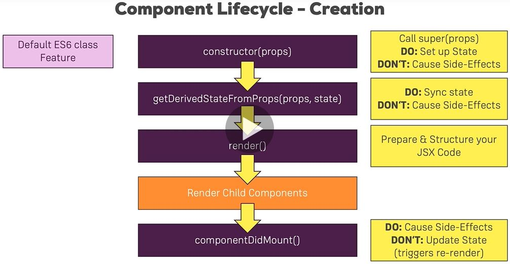

React component
==================
- More on useEffect(): https://reactjs.org/docs/hooks-effect.html
- State & Lifecycle: https://reactjs.org/docs/state-and-lifecycle.html
- PropTypes: https://reactjs.org/docs/typechecking-with-proptypes.html
- Higher Order Components: https://reactjs.org/docs/higher-order-components.html
- Refs: https://reactjs.org/docs/refs-and-the-dom.html

## Lifecycle

- Constructor(): call super(props); only to set up state
- getDerivedStateFromProps(): sync state, not used much
- getSnapshotBeforeUpdate(): last-minute DOM ops
- componentDidCatch()
- componentWillUnmount(): clean up eg listener, timer

commonly used hooks:
- `shouldComponentUpdate()`: can cancel updating process
- `componentDidUpdate()`: cause side-effect, DONOT update state
- `componentDidMount()`: use a lot, do cause side effects (http), but DONOT update state (trigger re-render)
- render(): prepare & structure jsx code

## useEffect in functional components
for function based component, it's called for every render cycle (in virtual DOM)
```shell script
useEffect(() => {});  // runs for every render
useEffect(() => {}, [props.persons] ); // triggered only persons are changed
useEffect(() => {}, [] ); // triggered only for the first time


useEffect(() => {
  console.log('start doing something');
  
  return () => {
    console.log('Cleanning up in useEffect');
  }
}, []);
```

## optimize with shouldComponentUpdate for class-based
```shell script
shouldComponentUpdate(nextProps, nextState) {
  return nextProps.persons !== this.props.persons; // only update when persons are changed
}
```

## optimize with memo() for functional
only render when props change
```shell script
export default React.memo(Cockpit)
```


## PureComponent instead of shouldComponentUpdate
Already implement shouldComponentUpdate to check if any props fields change
If your React component’s render() function renders the same result given the same props and state, 
you can use React. PureComponent for a performance boost in some cases. 
State change in parent component will not trigger re-render child component.
[When to Use React.PureComponent](https://medium.com/better-programming/when-to-use-react-purecomponent-723f85738be1#:~:text=PureComponent%20Is%20Primarily%20Used%20for,performance%20boost%20in%20some%20cases.)

```shell script
class Persons extends PureComponent {
}
```

## Render()
Render() does not immediately update the real DOM


## JSX Aux, Fragment
```shell script
// Aux.js
import React from 'react';
const aux = props => props.children;
export default aux;

// App.js
render() {
  return (
    <Aux><Person/></Aux>
  )
}

// or use React's provided Fragment
render() {
  return (
    <Fragment><Person/></Fragment>
  )
}
```


## HOC: higher order component
Add some css or logic before the component
add error handling, etc

```shell script
const auxClass = props => (
    <div className={props.classes}>{props.children}</div>
);
export default auxClass;

// another way for HOC
const withClass = (WrappedComponent, className) => {
    return props => (
        <div className={className}>
            <WrappedComponent {...props}/>
        </div>
    );
}

export default withClass;


// App.js
export default withClass(Person, classes.App);
```


## Set state correctly
setState() does not immediately update state and render
```shell script
this.setState({
  persons: persons,
  changeCounter: this.state.changeCounter + 1 // state may not updated, or updated by others
});

this.setState((prevState, props) => {
  return {
    persons: persons,
    changeCounter: prevState.changeCounter + 1
  }
});
```

## Prop types
Specify types for the component (normally when write js libraries)
```shell script
npm install --save prop-types

Person.propTypes = {
	click: PropTypes.func,
	name: PropTypes.string,
	age: PropTypes.number
}
```


## Refs
```shell script
componentDidMount() {
  this.inputElement.focus();  // will focus on "input" element below
}

<input 
  key="13"
  ref={(inputEl) => {this.inputElement = inputEl}}
/>
```

// or use React.createRef()

// for function based component, use hooks
```shell script
const toggleBtnRef = useRef(null);
useEffect(() => {
	toggleBtnRef.current.click();
```


## context api
- the prop chain problems
props passed down to list of Persons, then to each Person

directly pass data from A to B.  refer to Redux

// class-based
```shell script
// auth-context.js
const authCtx = React.createContext({authenticated: false, login: () => {})

// App.js
<AuthContext.Provider value={ {
  authenticated: this.state.authenticated, 
  login: this.loginHandler} }>
</AuthContext.Provider>

// Person.js
<AuthContext.Consumer>
  { context => context.authenticated ? <p>Authenticated</p> : 
          <button onclick={context.login}>Log In</button>; }
</AuthContext.Consumer>

// or use contextType, then no need to use AuthContext.Consumer
static contextType = AuthContext;
componentDidMoount() {
  console.log(this.context.authenticated);
}
```

// functional
```shell script
const authContext = useContext(AuthContext);

<button onClick={context.login}>Log In</button>
```


## useCallback
	function is cached, so it will not trigger another useEffect() run
useReducer


## Http request
Axios Docs: https://github.com/axios/axios
```shell script
npm install axios --save

componentDidMount() {
  axios.get('https://jsonplaceholder.typicode.com/posts')
    .then(response => {
      console.log(response);
      this.setState({posts: response.data});
    })
}
```

Best place: componentDidMount() { }


### Avoid infinite loading due to change of state
```shell script
if(this.props.id) {
	if(this.state.loadedPost && this.state.loadedPost.id !== props.id) {
		axios.get('https://jsonplaceholder.typicode.com/posts' + this.props.id).then(response => { } )
```

// POST, DELETE
```shell script
const data = {
    title: "moon",
    author: "test" 
  };

axios.post('https://jsonplaceholder.typicode.com/posts', data)
    .then(response => {})
    .catch(error => {console.log(error)});
```

### Axios interceptors
```shell script
axios.interceptors.request.use(request => {
  console.log(request);
  return request;
}, error => {
  return Promise.reject(error);
});

axios.interceptors.response.use(response => {
  console.log(response);
  return response;
}, error => {
  return Promise.reject(error);
})

// remove interceptors
var myInterceptor = axios.interceptors.request.use(function () {/*...*/});
axios.interceptors.request.eject(myInterceptor);
```

### Axios global settings
```shell script
axios.defaults.baseUrl = 'https://jsonplaceholder.typicode.com';
axios.defaults.headers.common['Authorization'] = 'AUTH TOKEN';

axios.get('/posts')
```

```shell script
// axios.js
const instance = axios.create({
  baseUrl = https://jsonplaceholder.typicode.com'
});
instance.defaults.headers.common['Authorization'] = 'AUTH TOKEN';
export default instance;

// App.js
import axiosInstance from '../../axios.js';
```