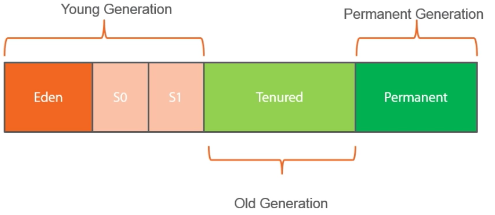
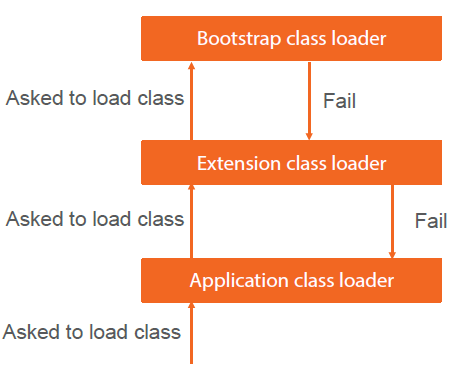

# Garbage Collection
Heap, stack, 方法区
- Heap: 新生代(Eden, S0, S1)，老年代 (tenured, based on GC times)
GC: 复制算法: 把还在用的data从S1复制到S0。

- Stack: 局部变量表，操作数栈，帧数据区(stack trace）
方法区(Perm)：class, method, constants
 

一般设置Xms = Xmx
`-Xmn` 设置新生代大小，
`-XX`: SurvivorRatio
HeapDump: memory analyzer
`-Xss` 线程的最大栈空间
`-XX:MaxPermSize` 方法区，所有线程共享，默认64MB
 
JDK1.7之后就是Server模式了，无需关心。


新生代使用复制算法，老年代使用标记算法 
分区算法：比如G1
`-XX:MaxTenuringThreshold` 默认15次，之后进入老年代

TLAB: Thread local allocation buffer 每个线程都有一个TLAB
对象创建流程：
 

串行垃圾回收器，并行，CMS, G1

---
# JVM memory management
Course: Understanding the Java Virtual Machine Memory Management

## Introduction
GC promise: claim no live objects, no promises about dead objects
Forms of GC
    No Nothing, Reference counting, mark and sweep, copying, generational, incremental

- Reference counted GC
- Mark -> sweep -> compact
- Copy: move to another contiuous space
- Generational: Yong generation, live objects moved to old generation block

## How GC works in JVM
Things to consider:
	Stop the world events, memory fragmentation, throughput

- Has "Young generation" and an "old generation"
- Most initial objects allocated in "Eden space", part of young generation
- Young generation also has two "survior" spaces
    - Objects survived a GC moved to survivor space
    - Only one survivor space in use at a time
    - Objects copied between survivor spaces
- Old generation is where long lived objects go to die


 

Turtle theory of GC: you die young or live forever
- Minor GC: swap survivor spaces
- Major GC: when old generation is full

Promotion to old generation
	Objects over a certain size will be allocated directly in old space

Pointer is cheap, but locks are expensive -> Thread Local

Live objects: eg from JNI, kept alive
Card Table
	Write to young space -> record in card table; when GC, young does not scan old, instead look into card table

## Different GC
 
- Serial collector: single threaded, stop the world; OK for small app
- Parallel collector: multiple threads for minor, single thread for major GC; use on server
- Parallel old collector: multi-threads for minor and major GC. Preferred over prev.
- Concurrent mark and sweep: only collects old space, causes heap fragmentation, designed to be lower latency
- G1 collector: java7
	For server app, multi-core with large memories
	Break into heap regions

Which GC? Profile the app under close to prod load as possible. Test it.

GC monitor tool
 
- Jps // find the pid
- Jstat -gccapacity 5240
- Jstat -gcutil 5240
- Jstat -gc 5240
G1 has much slower memeory allocation.

### Jvisualvm & visualGC
Jconsole, jmeter

## Java references classes
Weak reference
weakHashMap, referenceQueue
strong > soft > weak > phantom
 

---
# Understanding java vm class loading reflection
Course: Understanding the Java Virtual Machine: Class Loading and Reflection
2015.03
## Introduction
- Javac -sourcepath src src\com\pluralsight\Delegate.java -d classes	// compile
- Set CLASSPATH=classes	// global classpath
- Java com.pluralsight.Main
- Java -cp classes com.pluralsight.Main // local classpath
- Jar cvf helper.jar com\mantiso\Helper.class	// create jar
- Move helper.jar ..\lib
- Java -cp classes;lib\helper.jar com.pluralsight.Main // include lib in classpath


Java base libraries:
Jre\lib\Rt.java

## The Basics of Classloading
Bootstrap classloader -> load ext.jar

Hierarchy of classloaders, class loader may delegate to its parent, parent may load class
Application classloader, extension classloader, bootstrap classloader (written in C)

 
Loaded classes are cached
 

 

## Writing Our Own Class Loader
Use the URLClassLoader
Understand how this works
Load from a file based URL
Load from a network URL
Write our own classloader
Load from a database

// load from file based URL, but return an Object
 

Create an interface IQuote.java, which is loaded from application classpath (classes)
IQuote quote = (IQuote) clazz.newInstance();
System.out.println(quote.getQuote());


Load from network (put the jar file under tomcat/ROOT):
URL url = new URL(http://localhost:8080/Implementations.jar);

Load class from database

Extends java.lang.ClassLoader

Side by side deployment
Might want to load different versions of the same class
IDE extensions require different verions of XML parsers
Classloader provides isolation

ClassLoader ucl = new URLClassLoader(...);
Class.forName("com.pluralsight.Quote", true, ucl);
 

Class clazz1 = Class.forName("com.pluralsight.Quote", true, ucl1);
Class clazz2 = Class.forName("com.pluralsight.Quote", true, ucl2);

Note that Clazz1 != clazz2!!

### Factory pattern
// normal factory way
CanonCamera
CanonCameraFactory
ICamera
ICameraFactory
NikonCamera
NikonCameraFactory

ICameraFactory = cameraFactory = new NikonCameraFactory();
ICamera camera = CameraFactory.CreateCamera();
Camera.takePhoto(); // Nikon photo taken

// better way with configuration and class loader
 

## Hot deployment
Classloaders give us the ability to reload classes dynamically
Can ship new code to the application without having to unload the application

Load client code with application classloader
Load server code with custom classloader (under serverclass folder)

ClassLoader mondayLdr = new URLClassLoader(cust1urls);
Class mondayClass = Class.forName("MainClass", true, mondayLdr);
ClassLoader fridayLdr = new URLClassLoader(cust1urls);
Class fridayClass = Class.forName("MainClass", true, fridayLdr);

Allows 24/7 operation of servers

## Reflection
Can use reflection to
Get details of classes at runtime
Dynamically get values of data at runtime
Dynamicaly update objects
	Create instances of types we have no compile time information about

```shell script
Class cls = Car.class;
Cls.newInstance();

Method[] methods = cls.getMethods(); // all methods, toString()
Method m = methods[0];
m.getName()
m.getParamerCount()
cls.getDeclaredMethods(); // user defined

Class superclass = cls.getSuperclass();
Constructor[] ctors = cls.getDeclaredConstructors();
Construtor c = ctors[0];
c.getParameters();
p.getName(), p.getType()

Field[] fields = cls.getDeclaredFields();
Field f = cls.getDeclaredField("people");
Class t = f.getType();
System.out.println(t.isArray());

Car car = (Car) ctors[1].newInstance(4); // should use interface, not Car
Method m = cls.getDeclaredMethod("drive", char.class, int.class);
Method.invoke(car, 'D', 6);

// invoke static method
m = cls.getDecaredMethod("print");
m.invoke(null);

// invoke private method
m = cls.getDeclaredMehtod("accelerate");
m.setAccessible(true); // security manager can prevent this!
m.invoke(car);

// public fields
Field f = cls.getDeclaredField("speed");
Object obj = f.get(car);  // depends on specific instance
f.set(car, 44);

Field f2 = cls.getDeclaredField("people");
Array.set(fied.get(car), 1, "Kevin");
Object obj = Array.get(field.get(car), 1);  // obj == Kevin

Class clazz = String[].class;
// clazz = Class.forName("[Ljava.lang.String;");
```


Building an IoC container
To be re-watched
Use classloader and reflection


Understanding the Java Virtual Machine Security
--------------------------------------------------
Course: Understanding the Java Virtual Machine Security, 2015.07
Understand how Java ensures code is safe to run
    Code, not user

Can loaded code execute specific actions?
    Read/write to a file?
    Access the network?

Java code is mobile
Don't trust all locations code can be loaded from
May want to lower the trust level for specific libraries
This lowers any attack surface area
Principle of 'least privilege'

## Principal Players in Security
- Permissions
    Is code allowed to perform some operation?
- Policy
    How do I determine if the code is allowed to run that operation?
- Enforcement
    Any policy violations should be shouted very loudly
    Any policy violations should be un-ignorable

