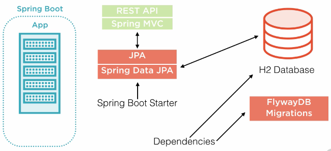

Spring boot
================
https://github.com/in28minutes
- Udemy: microservices-with-spring-boot-and-spring-cloud (Udemy.com $15)


## Webservice
1.	Communication between machines
2.	Independent of app platform (java, .Net, php, python…)
3.	Communication via network
dispatcherServlet is the real one that handles all request/response
- SOAP: use XML, WSDL for service definition, works for HTTP or MQ
- REST: just an architecture, optimized for HTTP only; JSON is used mostly

- @RequestMapping
- @GetMapping
- @DeleteMapping

```
//application.properties
	logging.level.org.springframework=debug
```

- Java 1.8, Maven
- Spring initializer
https://github.com/spring-projects/spring-boot/tree/master/spring-boot-samples
```shell script
@SpringBootApplication
@Configuration
@EnableAutoConfiguration
@ComponentScan
```

## Generic Exception handler
```shell script
@ControllerAdvice
@RestController
public class CustomizedResponseEntityExceptionHandler extends ResponseEntityExceptionHandler {
  @ExceptionHandler(Exception.class)
  public final ResponseEntity<Object> handleAllExceptions(Exception ex, WebRequest request) {
    ExceptionResponse exceptionResponse = ExceptionResponse.builder().exceptionTime(LocalDateTime.now()).message(request.getDescription(false)).build();
    return new ResponseEntity<>(exceptionResponse, HttpStatus.INTERNAL_SERVER_ERROR);
  }
}
```


## Delete an item from a list with Iterator
```shell script
Iterator<User> it = users.iterator();
While(iterator.hasNext()) {
	If(user.getId() == id) {
		iterator.remove();
	}
}

@GetMapping("users")  // localhost:8080/users?id=1
Public User getUser(@RequestParam String id) {
	Return userService.get(id);
}
```


## Add logging to request
Spring already provides a filter that does this job. Add following bean to your config
```shell script
@Bean
public CommonsRequestLoggingFilter requestLoggingFilter() {
    CommonsRequestLoggingFilter loggingFilter = new CommonsRequestLoggingFilter();
    loggingFilter.setIncludeClientInfo(true);
    loggingFilter.setIncludeQueryString(true);
    loggingFilter.setIncludePayload(true);
    return loggingFilter;
}
```
Don't forget to change log level of org.springframework.web.filter.CommonsRequestLoggingFilter to DEBUG.


## Validation post body
```shell script
@PostMapping("users")  // json string auto mapped to User object
public ResponseEntity<Object> createUser(@Valid @RequestBody User user) { }
Public class User {
	@Size(min=2, message="Name >= 2 chars") private String name;
	@Past private Date birthDate;
} 
// if validation failed, it will return 400 Bad Request
```


Validator.jar, Hibernate-validator.jar


## HATEOAS
- Api also return other useful information.
/users/{id}, return user and also a link for the user
```shell script
<dependency>Spring-boot-starter-hateoas</dependency>
Resource<User> resource  = new Resource<User>(user);
```


## I18n
LocaleResolver –Default Locale –Locale.US
```shell script
ResourceBundleMessageSource
Messages.properties // default locale
Message_fr.properties	// French
@Autowired MessageSource
@RequestHeader(value="Accept-Language" required=false Locale locale
messageSource.getMessage("helloworld.message", null, locale);
```


## Content negotiation
- Accept: application/xml	// => 406 Not Acceptable
- Just add this library: <artifact>jackson-dataformat-xml</artifact>
- Now it can return results in xml format

## Swagger
```shell script
<artifactId>springfox-swagger2</artifactId>
<artifactId> springfox-swagger-ui</artifactId>

@Configuration
@EnableSwagger2
Public class SwaggerConfig { 
	// refer ApiInfo.class for DEFAULT_API_INFO
	@Bean
	Public Docket api() {
		Return new Docket(DocumentationType.SWAGGER2).apiInfo(DEFAULT_API_INFO);
	}
}
```


- Localhost:8080/v2/api-docs	// high level api info in json format
- Localhost:8080/swagger-ui.html

```shell script
@ApiModel(description="User details")
Public class User {	
	@Past
	@ApiModelProperty(notes="Birthd date should not be a future date")
	Private Date birthDate;
```

@ApiOperation
@Authorization


## Monitor API w/ Actuator & HAL
HAL – Hypertext Application Language
```shell script
Stateless.co/hal_specification.html
<artifactId>spring-boot-starter-actuator</artifactId>
<artifactId>spring-data-rest-hal-browser</artifactId>
Localhost:8080/application
Application.properties
	management.security.enabled=false
```

/application/trace 	// record the last 100 request with details


## API filtering
Filter out some properties of a bean, such as password
```shell script
@JsonIgnore
Private String password;

@JsonIgnoreProperties(value={"field1", "field2"})
Public class SomeBean { }
```


## Dynamic filtering
```shell script
SimpleBeanPropertyFilter filter = new SimpleBeanPropertyFilter.filterOutAllExcept("filter1", "filter2");
FilterProvider filters = new SimpleFilterProvider().addFilter("SomeBeanFilter");
MappingJacksonValue mapping = new MappingJacksonValue(list);
Mapping.setFilters(filters);
Return mapping;
@JsonFilter("SomeBeanFilter")
Public class SomeBean() {}
```


## Versioning
1.	/v1/person -> /v2/person	// Twitter, cacheable
2.	/person/param, params="version=2"	// Amazon, cacheable
3.	/person/header, headers="X-API-VERSION=1"	// Microsoft
4.	/person/produces, produces="application/vnd.company.app-v1+json" // Github


## Basic Authentication
userId/psd
<artifactId>spring-boot-starter-security</artifactId>
// default user name is "user", password is in the logs
```shell script
Application.properties
	security.user.name=username
	security.user.password=password
	management.security.enabled=true	//localhost:8080/application/env will require user/psw
```

## Configuring and Accessing a Data Source



DataSource pooling
	Default tomcat-jdbc
Flyway: data migration
```shell script
@Configuration
public class PersistenceConfiguration {
  @Bean
  @ConfigurationProperties(prefix="spring.datasource")
  @Primary
  public Datasource datasource() {
    return DatasourceBuilder.create().build();
  }

  @Bean
  @ConfigurationProperties(prefix="datasource.flyway")
  @FlywayDataSource
  public Datasource flywayDataSource() {
    return DatasourceBuilder.create().build();
  }
}
```
Spring.datasource properties are in the application.properties

manage database migration
	Easy to manage, recreate database
	All code in source control
	No DBA needed (CON too)
	Multiple independent upgrades
	Work across databases (don’t always work)
```shell script
flyway {
    url= 'jdbc:mysql://localhost:3306?useSSL=false'
    user = 'root'
    password = 'p4ssw0rd'
    schemas = ['jacketdb']
    locations = ["filesystem:common", "filesystem:mysql"]
    outOfOrder= true
}
Spring data
Abstraction that provides access to various databases
public interface ArticleRepository extends Repository<Article, Long> {}

public interface ArticleRepository extends CrudRepository<Article, Long> {}

public interface ArticleRepository extends CrudRepository<Article, Long> {
List<Article> findByTitle(String title);
}
```

## JPA

```shell script
<artifactId>sprint-boot-starter-data-jpa</artifactId>
<artifactId>h2</artifactId>
<scope>runtime</runtime>

security.basic.enabled=false
spring.jpa.show-sql=true
Spring.h2.console.enabled=true		
// localhost:8080/h2-console, make sure db is jdbc:h2:mem:testdb
```

Table will be auto created based on @Entity

// add custom sql to resources path, Data.sql
```shell script
Insert into user values(1, sysdate(), 'AB');
Insert into user values(2, sysdate(),  'Jim');
```

```shell script
@Repository
Public interface userRespository extends JpaRepository<User, Integer> {}

@Repository
public interface MovieRepository extends CrudRepository<Movie, Long> {
    Movie findByCntitle (String cntitle);
    Movie findByTitle (String Title);

    List<Movie> findAll ();
}


@Autowired
Private UserRepository userRepository;

@Entity
Public class Post {
	@ManyToOne(fetch=FetchType.LAZY)
	@JsonIgnore  // prevent call Post/User in loop
	Private User user;

@Entity
@Table(name = "user")
Public class User {
    @Id
    @GeneratedValue
    private Long id;
    
    @OneToMany(mappedBy="user")
    Private List<Post> posts;
}

// post a new message post
User user = userRepository.findById(id).get();
Post.setUser(user);
postRepository.save(post);
```


## Richardson Maturity Model
How RESTful are you?
1. Level 0: Expose SOAP webs service in REST style
2. Level 1: Expose resources with property URI
3. Level 2: Level 1 + methods (GET, POST, PUT, DELETE)
4. Level 3: level 2 + HATEOAS (extra info like url, next possible action)


## REST best practices
- Consumer first: make sure consumer will understand
- Make best use of HTTP (method, response type(200, 201, 400, 401, 404)
- No secure info in URI
- Prefer plurals: prefer /users, instead of /user
- User Nouns
- Keep consistent


## Test
```shell script
<dependency>
   <groupId>org.springframework.boot</groupId>
   <artifactId>spring-boot-starter-test</artifactId>
   <scope>test</scope>
</dependency>
```

AppTest.java
	Run as Junit test
	Runn as mvn test

Integration test
```shell script
@RunWith(SpringJunit4ClassRunner.class)
@SpringApplicationConfiguration(App.class)
public class ShipwreckRepositoryIntegrationTest {
  @Autowired
  private ShipwreckRepository shipwreckRepository;

  @Test
  public void testFindAll() {
    List<Shipwreck> wrecks = shipwreckRepository.findAll();
   assertThat(wrecks.size(), is(greaterThanOrEqualTo(0)));
  }

}
```
 
It’s like running the app!

Web integration test 
== calling REST api
May only set up on integration build when someone else checked in code
```shell script
@RunWith(SpringJunit4ClassRunner.class)
@SpringApplicationConfiguration(App.class)
@WebIntegrationTest
```