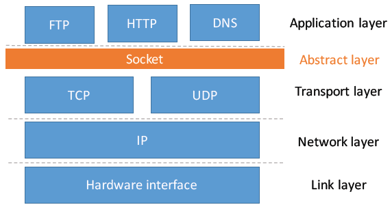
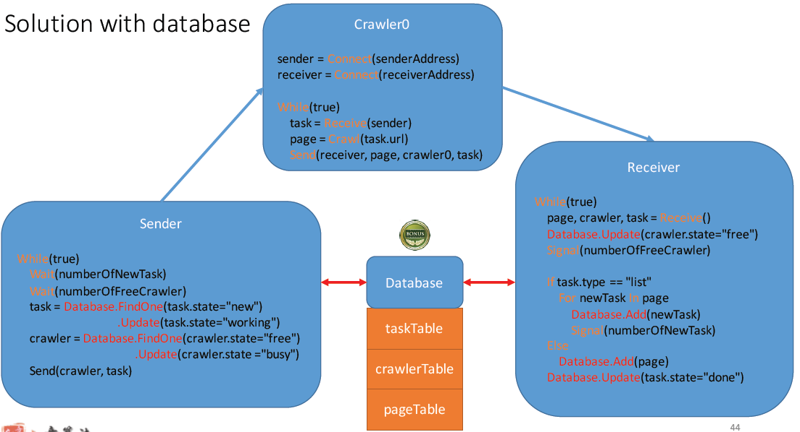
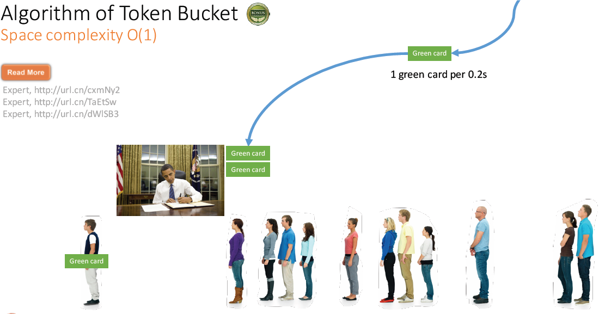
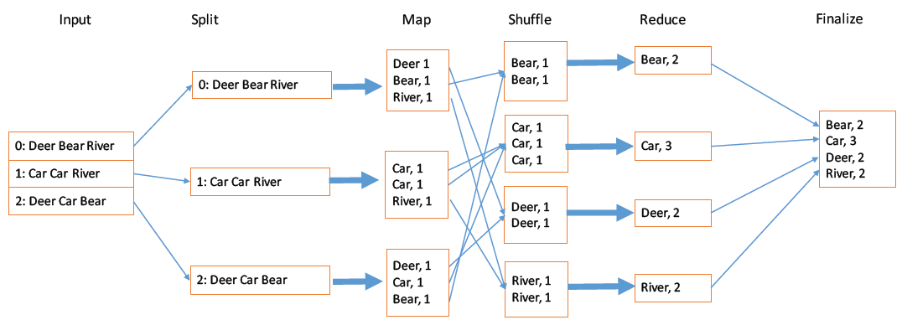
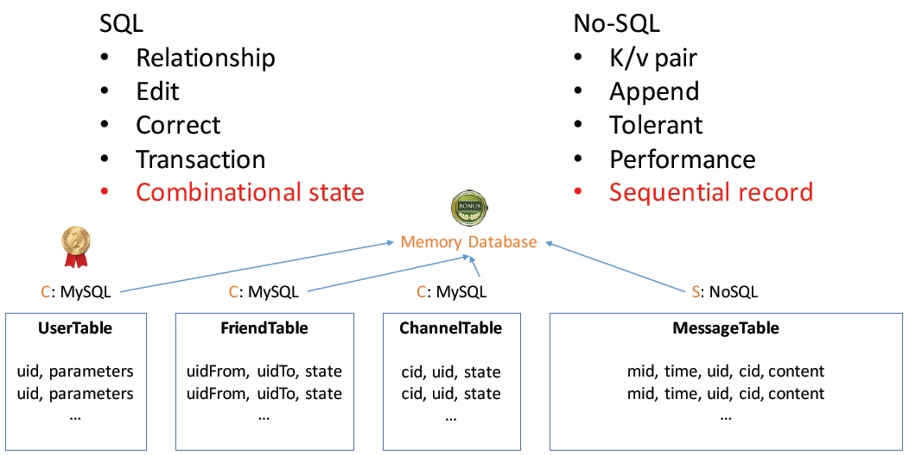

System design
=================
Architecture patterns
1.	Layered/n-tier: presentation – business – persistence
    a.	Moder patter is still similar. Electrode: React.js + Node.js + Cassandra
    b.	Sharded: distribute request to different shards (a-f, g-k…)
2.	Microservices
3.	Microkernernal with plugins
    a.	VSCode, Browser
4.	Lambda (serverless)
5.	Event based 
    a.	Kafka
    
    
9章
Common components in any application (SLAM HE):
Security: authentication, authorization
	Logging
	Health: monitor
	Metrics: dashboard, report
	Audit: 
	Resilience: exception, error handling
	

## Introduction - SNAKE
SNAKE
• Scenario:
case/interface
• Necessary:
constrain/hypothesis
• Application:
service/algorithm
• Kilobit:
data
• Evolve	

### Design netflix

### Developer evaluation
入门 -> 深度 -> 广度 -> 经验 -> 预测
Coding: 2.5
Design: 2
Learning: 4
总结/表达/教学: 3

### Design recommendation module
U1 = {}
U2 = {}
Similarity(u1, u2) = 3
For a user, find his top-1 similar user
Interface
Class Recommender {
	Public:
		Int FindSimilarUser(int userID);
	}
}

 


## Database system (PayPal)
Design a user system
Register/update/remove
Login/logout
Balance/membership
```shell script
Class User {
	Int userID (primary ID);
	String username;
	String hiddenPassword;
	Int state;
	Vector<Session> sessionList;
}
Class UserTable {
	Private vector<User> table;
	Insert; delete; update; select;
}
```


Interviewer:
Support user management functions, such as verification and ban?
Ngx: single thread


### Design the processes
Auto logout after a period of inactive
Login from multiple devices
Session life cycle
	Session is a conversation between user and server; user can have multiple sessions.
Session is updated more frequently, so create a separate table for sessions.
"remember me"
	Time_out set for 5 days; DO NOT save user/psw in browser.

UserTable and SessionTable => inheritance
Index with B+Tree: hard disk friendly, logbn

### Support payment on membership
Add transaction with log

Checker 
	checkUnknownUser()
	checkDuplicatedUser()

ACID
	Atomic, consistency, isolation, durability

### Design PayPal
Scenario
Send/receive
Refill/transfer/pay
Necessary
	Daily 1MM 
	QPS = 1MM * 5 * 1% * 1 / 86400 ~ 1/s
Application (refill)
	Bank -> ID -> balance -> verify
	State? In refill, refill successful, refill failed
	If refill succeeded, next?
		Log (dataflow) -> lock/transaction (load, update) -> submit -> notify
		
Data
	User Table
	Payment method: userID, bankID, refill_limit
	Order Table


## Web crawler and tinyURL
Rank, search, recommend
Socket()
	3-handshake (syn, syn-ack, ack)

 

## Design scheduler
Solution with sleep
```shell script
While(true)
  Lock(taskTable)
  If taskTable.Find("state=new")==NULL
    Release(taskTable)
    Sleep(1s)
  Else
    Task = taskTable.FindOne("state=new")
    task.state = "working"
    Release(taskTable)
    Page = Crawl(task.url)
    If task.type == "list"
        Lock(taskTable)
        For newTask in page:
          taskTable.Add(newTask)
        task.state = "done"
        Release(taskTable)
    Else
        Lock(pageTable)
        pageTable.Add(page)
        Release(pageTable)
        Lock(taskTable)
        task.state = "done"
        Release(taskTable)

```

### Design scheduler with conditional variable
Producer - consumer
While(taskTable.Find(“state=new”) == NULL)
Cond_wait(cond, taskTable)
… …
Condi_signal(cond)

### Design scheduler with semaphore
Simple to use
Wait(numberOfNewTask)
…
Signal(numberOfNewTask)

## Design fastest consumers and producers
LMAX disruptor, non-blocking, thread-safe
 

## Distributed crawler with database
难点：并发和数据同步



## tinyURL
Base62

- average size of long url = 100 bytes
- average size of short url = 4 bytes (int)
- state = 4 bytes
- daily new url = 100,000 * 108 = 10MB
- yearly new url = 10 * 365 = 3.6GB

 
Not much data, can be saved in DB or just in memory

• How to support random?
• Random(0,range)
• How to avoid conflicting?
• Try again
• How to implement time-­limited service?
• Expire/state
• How to cache?
• Pre-load
• Replacement

如果突然来了100万request
1.	Queue, async (some requests will be processed later)
2.	Rate limiter
3.	More server
4.	全内存: redis, memCache
5.	Load balancer (related to more servers)
Nginx
 

## Web service and rate limiter
Audio player issues
Use cookie to identify a user
Use log to collect failure rate
Process of playing online radio
 
Reverse proxy: 请求打包，缓存，load balance,
 
 
4级代理
正向代理不知道server

CDN

one day retention rate = (# of users visited in both day and day+1) / # of users visited for day
回头率
New user retention rate > 10% => very good

Rate limiter
Limit QPS = 5
1.	Gap = 0.2s
2.	Time-bucket
3.	database
Key-value, after 1s, expire old data
How to limit 5 in any 1 second
	Use queue

 

### 秒杀 second killer
Million requests -> Queue 1 to reduce requests (separate server) -> Queue 2 with 100 requets

How many items? QPS?
One Nginx can normally handle 10k QPS
如何单机模拟10kQPS
- How to reduce traffic
    - reduce page size: no image
    - cache more: static page
    - proxy: batch, connection
    - limit request: JS, balancer

- How to keep it simple, sweetie
    - No DB: memory + log
    - No lock


## Distributed system
Google file system
ChunkServer send heartbeat
Hot spot: load rebalance

### BigTable
Sorted index keys
Table -> tablet -> list of key-values
Write into a memTable to increase speed
A tablet = memTable + a list of SSTables
Transaction + log
Index of blocks -> preloaded in memory
Bloomfilter: 99.9% sure queried data is in a certain block

Save table in GFS

MapReduce
Spark: 优化后的MapReduce
Build inverted index


Log 卡夫卡 Kafka


## Feed & chat
Feed
Feeds, timeline, social graph
Msg -> write API -> fanout (social graph, O(n)) -> timeline lists -> timeline service (O1) -> display
Msg -> write API -> feed lists -> timeline service (social graph, pull) -> display
Facebook pull all; Instagram push all.

### How to speed up?
Steep up with memory
SSD instead of HDD
Save space with active user list
	Only cache the users active in 1 week, latest 800 tweets
	Only save userID + tweetID + indicator = 20Byte
	1TB memory (doable)
New user -> timeline builder -> append -> load

RESTful
	所有资源有统一标识符： get, post, 
	4接口：增删改查
	无状态


## Chat
	userTable, friendTable, channelTable, messageTable

 

Batch message: 50 messages/sec -> use only 1 head/tail
Chat message history can use feed architecture.
Pull, push
Data-pull/push
Link-pull/push
Only notify # of messages, then user chooses to pull messages.


## Typeahead and OOD
Typeahead
提示, Match case
Average latency < 100ms
    95% < 50ms
Evaluation: Latency/Cpu/memory/bandwidth/qps
Algo: 
    BST	O(log n + k)
	Trie tree	O(length(word) + k)
	Ternary search tree
Database
	Select * from name_table where name like ‘$query%’

Friend of friend
	Algo: merge k-list?

### OOD
Design parking lot
Design Blackjack with AI
Design achievement system
Design elevator
